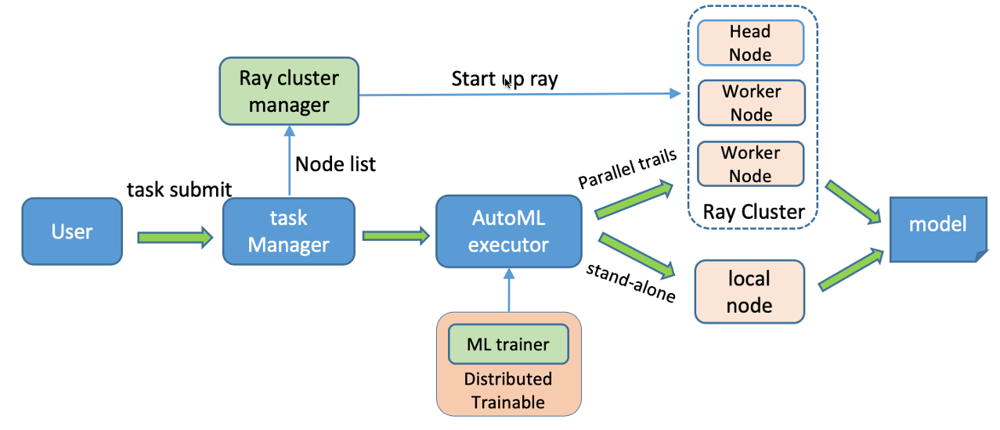

## Introduction

dml-autotabular is a lightweight automl tool on the basis of FLAML and Ray Tune. It supports common machine learning tasks like classification, regression,
and timeseries forcasting task with deep neural networks.
that finds accurate machine learning models automatically, efficiently and economically. It frees users from selecting
learners and hyperparameters for each learner.

For common machine learning tasks like classification and regression, it quickly finds quality models for user-provided data with low computational resources. 
It frees users from selecting earners and hyperparameters for each learner.
For timeseries forcasting task, Autoformer, FEDformer,Transformer and Informer being supported now.
Tuning distributed with multi-core and multi-node. 

### structure overview
- common/ray_cluster_manager: Ray operator to manage a ray cluster according to a list of nodes, on which we can do trails in parallel. 
- classification: Automl module for classification task of tabular data
  - run.py: Main entrance for task submission.
  - interface
    - tune_main.py automl executor interface.
  - data_provider: data loader and preprocess.
- regression: Automl module for regression task of tabular data
  - run.py: Main entrance for task submission.
  - interface
    - tune_main.py automl executor interface.
  - data_provider: data loader and preprocess.
- forecasting: Automl module for forecasting task
  - run.py: Main entrance for task submission.
  - interface
    - tune_main.py automl executor interface.
    - tune_trainable.py ML trainable class
  - models
    - forcasting models interface
  - data_provider: data process and data loader.
- examples
  - some shell examples to run automl task, you can execute it as: 
  ```commandline
    bash ./examples/run_ts.sh
  ```
### Architecture in a glance



## Installation

### Prepare environment

1. Install python and related develop environments following the instructions:
   
   Set environments
   ```
   vim ~/.bashrc
   ``` 
   ```
   export JAVA_HOME=/usr/local/jdk1.8.0_77
   export PATH=$JAVA_HOME/bin:$PATH
   export CLASSPATH=.:$JAVA_HOME/lib/dt.jar:$JAVA_HOME/lib/tools.jar
   export HADOOP_HOME=/usr/local/hadoop-current
   export HADOOP_HDFS_HOME=/usr/local/hadoop-current
   export PATH=$HADOOP_HOME/bin:$PATH
   export CLASSPATH=`$HADOOP_HOME/bin/hadoop classpath --glob`
   export LD_LIBRARY_PATH=$LD_LIBRARY_PATH:$JAVA_HOME/jre/lib/amd64/server
   ```
   ```
   source ~/.bashrc
   ```

2. Install dependencies:
   ```
   sudo yum install gcc gcc-c++ python36 python3-devel -y
   sudo pip3 install --upgrade pip
   ```
3. Install flaml:
   ```
   pip install "flaml[ray,nni,blendsearch]"
   pip install pyarrow==7.0.0
   ```
4. install torch, torchvision:
    ```commandline
    pip install torchvision "flaml[blendsearch,ray]"
    ```

### Install dml-autotabular
   Clone the repository and then install it:
   ```
   git clone git@xxx.git
   cd dml-automl
   sudo python3 setup.py install
   ```
## Example
   ```
    example1:
        python3 ./classification/run.py --train_data ./data/iris_data.csv --label_col label --output_path ./test.outputs --time_budget 20 --task classification --metric accuracy --estimator_list "['lgbm']" --seed 1 
    example2, Parallel tuning:
        python3 ./classification/run.py --train_data ./data/iris_data.csv --label_col label --output_path ./test.outputs --time_budget 60 --task classification --metric accuracy --estimator_list '["lgbm"]' --estimator_kwargs '{"n_jobs":4,"n_concurrent_trials":3}' --seed 1
    example3, train data at hdfs:
        python3 ./classification/run.py --train_data train_data_dir --test_data testdata_dir --label_col label --time_budget_s 60 --metric roc_auc --estimator_list '["lgbm","xgboost"]' --seed 1
        python3 ./classification/run.py --train_data train_data_dir --test testdata_dir --label_col order_cnt_7 --time_budget_s 240 --metric rmse --estimator_list '["lgbm","xgboost"]' --seed 1 --estimator_kwargs '{"n_jobs":-1,"n_concurrent_trials":3}' 
        python3 ./regression/run.py --host_file /etc/HOROVOD_HOSTFILE --train_data train_data_dir --test testdata_dir --label_col order_cnt_7 --time_budget_s 300 --metric rmse --estimator_list '["lgbm"]' --seed 1 --estimator_kwargs '{"n_jobs":-1,"n_concurrent_trials":3}' 
    example4, submit job with node_list:
        python3 ./classification/run.py --node_list '["172.17.126.125","172.17.126.126","172.17.126.124"]' --train_data c000.snappy.parquet --test_data testdata_dir --label_col label --output_path ./test.outputs --time_budget_s 60 --metric roc_auc --estimator_list '["lgbm"]' --estimator_kwargs '{"n_jobs":-1,"n_concurrent_trials":3}'  --seed 1
        python3 ./classification/run.py --host_file /etc/HOROVOD_HOSTFILE --train_data ./data/iris_data.csv --label_col label --output_path ./test.outputs --time_budget_s 20 --task classification --metric accuracy --estimator_list '["lgbm"]' --estimator_kwargs '{"n_jobs":-1,"n_concurrent_trials":3}'  --seed 1
    example5, submit job by startup script:
        sh run.sh ./classification/run.py --host_file /etc/HOROVOD_HOSTFILE ...
    
    timeseries forecasting task example:
        python3 ./forecasting/run.py --distributed --is_tune --seed 1234 --train_data dataset/ETT-small/ETTh1.csv --valid_rate 0.2 --output_path ts_test.outputs --time_budget_s 300 --num_samples 4 --num_workers 1 --num_gpus_per_worker 1 --workers_per_node 1 --search_space '{"model":["FEDformer","Autoformer"],"d_model":[64,512],"n_heads":[4,8],"d_ff":[128,2048],"learning_rate":[0.00001,0.001]}' --model Autoformer --features M --target OT --date_col date --features_col "['HUFL','HULL','MUFL','MULL','LUFL','LULL']" --freq h --seq_len 96 --label_len 48 --pred_len 24 --cross_activation tanh --moving_avg 25 --train_epochs 2 --patience 2 --batch_size 32 --loss mse
    ```