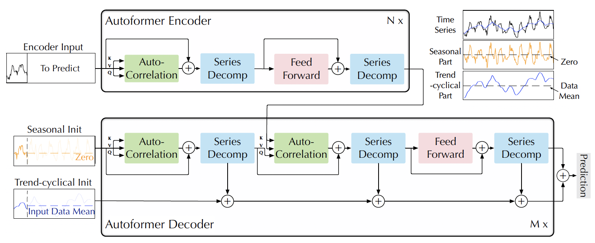

# Autoformer (NeurIPS 2021)

Autoformer: Decomposition Transformers with Auto-Correlation for Long-Term Series Forecasting

Time series forecasting is a critical demand for real applications. Enlighted by the classic time series analysis and stochastic process theory, we propose the Autoformer as a general series forecasting model [[paper](https://arxiv.org/abs/2106.13008)]. **Autoformer goes beyond the Transformer family and achieves the series-wise connection for the first time.**

In long-term forecasting, Autoformer achieves SOTA, with a **38% relative improvement** on six benchmarks, covering five practical applications: **energy, traffic, economics, weather and disease**.

:triangular_flag_on_post:**News** (2022.02-2022.03) Autoformer has been deployed in [2022 Winter Olympics](https://en.wikipedia.org/wiki/2022_Winter_Olympics) to provide weather forecasting for competition venues, including wind speed and temperature.

## Autoformer vs. Transformers

**1. Deep decomposition architecture**

We renovate the Transformer as a deep decomposition architecture, which can progressively decompose the trend and seasonal components during the forecasting process.

<p align="center">

<br><br>
<b>Figure 1.</b> Overall architecture of Autoformer.
</p>

**2. Series-wise Auto-Correlation mechanism**

Inspired by the stochastic process theory, we design the Auto-Correlation mechanism, which can discover period-based dependencies and aggregate the information at the series level. This empowers the model with inherent log-linear complexity. This series-wise connection contrasts clearly from the previous self-attention family.

<p align="center">

<br><br>
<b>Figure 2.</b> Auto-Correlation mechansim.
</p>


3.Special-designed implementation

- **Speedup Auto-Correlation:** We built the Auto-Correlation mechanism as a batch-normalization-style block to make it more memory-access friendly. See the [paper](https://arxiv.org/abs/2106.13008) for details.

- **Without the position embedding:** Since the series-wise connection will inherently keep the sequential information, Autoformer does not need the position embedding, which is different from Transformers.

## Main Results

We experiment on six benchmarks, covering five main-stream applications. We compare our model with ten baselines, including Informer, N-BEATS, etc. Generally, for the long-term forecasting setting, Autoformer achieves SOTA, with a **38% relative improvement** over previous baselines.

<p align="center">

</p>

## Baselines

We will keep adding series forecasting models to expand this repo:

- [x] Autoformer
- [x] Informer
- [x] Transformer
- [x] Reformer
- [ ] LogTrans
- [ ] N-BEATS

## Citation

If you find this repo useful, please cite our paper. 

```
@inproceedings{wu2021autoformer,
  title={Autoformer: Decomposition Transformers with {Auto-Correlation} for Long-Term Series Forecasting},
  author={Haixu Wu and Jiehui Xu and Jianmin Wang and Mingsheng Long},
  booktitle={Advances in Neural Information Processing Systems},
  year={2021}
}
```

## Contact

If you have any questions or want to use the code, please contact whx20@mails.tsinghua.edu.cn.

## Acknowledgement

We appreciate the following github repos a lot for their valuable code base or datasets:

https://github.com/zhouhaoyi/Informer2020

https://github.com/zhouhaoyi/ETDataset

https://github.com/laiguokun/multivariate-time-series-data


# FEDformer (ICML 2022 paper)

Tian Zhou, Ziqing Ma, Qingsong Wen, Xue Wang, Liang Sun, Rong Jin, "FEDformer: Frequency Enhanced Decomposed Transformer for Long-term Series Forecasting," in Proc. 39th International Conference on Machine Learning (ICML 2022), Baltimore, Maryland, July 17-23, 2022

Frequency Enhanced Decomposed
Transformer (FEDformer) is more efficient than
standard Transformer with a linear complexity
to the sequence length [[paper](https://arxiv.org/abs/2201.12740)]. 

Our empirical studies
with six benchmark datasets show that compared
with state-of-the-art methods, FEDformer can
reduce prediction error by 14.8% and 22.6%
for multivariate and univariate time series,
respectively.

## Frequency Enhanced Attention
||
|:--:| 
| *Figure 1. Overall structure of FEDformer* |

| | 
|:--:|:--:|
| *Figure 2. Frequency Enhanced Block (FEB)* | *Figure 3. Frequency Enhanced Attention (FEA)* |


## Main Results


## Get Started

1. Install Python 3.6, PyTorch 1.9.0.
2. Download data. You can obtain all the six benchmarks from [[Autoformer](https://github.com/thuml/Autoformer)] or [[Informer](https://github.com/zhouhaoyi/Informer2020)].
3. Train the model. We provide the experiment scripts of all benchmarks under the folder `./scripts`. You can reproduce the experiment results by:

```bash
bash ./scripts/run_M.sh
bash ./scripts/run_S.sh
```


## Citation

If you find this repo useful, please cite our paper. 

```
@inproceedings{zhou2022fedformer,
  title={{FEDformer}: Frequency enhanced decomposed transformer for long-term series forecasting},
  author={Zhou, Tian and Ma, Ziqing and Wen, Qingsong and Wang, Xue and Sun, Liang and Jin, Rong},
  booktitle={Proc. 39th International Conference on Machine Learning (ICML 2022)},
  location = {Baltimore, Maryland},
  pages={},
  year={2022}
}
```

## Further Reading
Survey on Transformers in Time Series:

Qingsong Wen, Tian Zhou, Chaoli Zhang, Weiqi Chen, Ziqing Ma, Junchi Yan, and Liang Sun. "Transformers in time series: A survey." arXiv preprint arXiv:2202.07125 (2022). [paper](https://arxiv.org/abs/2202.07125)


## Contact

If you have any question or want to use the code, please contact tian.zt@alibaba-inc.com or maziqing.mzq@alibaba-inc.com .

## Acknowledgement

We appreciate the following github repos a lot for their valuable code base or datasets:

https://github.com/thuml/Autoformer

https://github.com/zhouhaoyi/Informer2020

https://github.com/zhouhaoyi/ETDataset

https://github.com/laiguokun/multivariate-time-series-data

