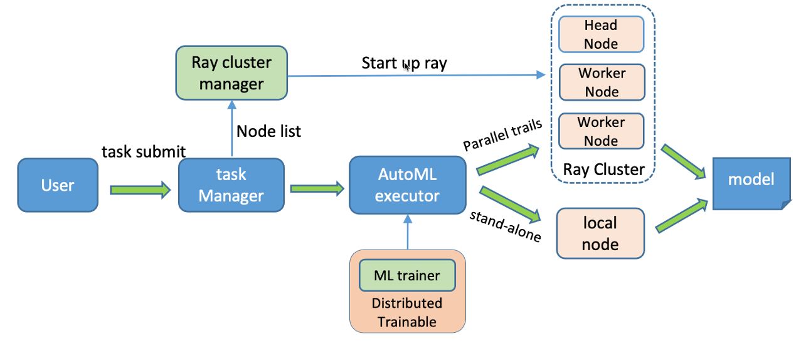

## Introduction

dml-autotabular is a lightweight automl tool on the basis of FLAML and Ray Tune. It supports common machine learning tasks like classification, regression,
and timeseries forcasting task with deep neural networks.
that finds accurate machine learning models automatically, efficiently and economically. It frees users from selecting
learners and hyperparameters for each learner.

For common machine learning tasks like classification and regression, it quickly finds quality models for user-provided data with low computational resources. 
It frees users from selecting earners and hyperparameters for each learner.
For timeseries forcasting task, Autoformer, FEDformer,Transformer and Informer being supported now.
Tuning distributed with multi-core and multi-node. 

### Architecture 



## Installation

### Install dml-autotabular
   Clone the repository and then install it:
   ```
   git clone https://xxx.git
   cd dml-autotabular
   sudo python3 setup.py install
   ```
## Example
   ```
   autotabular-classification --train_input alita_dev.criteo_100w --data_format table --output_dir my_model --label_cols "['label']" --feature_cols "['c1','c2','c3','c4','c5','c6','c7','c8','c9','c10','c11','c12','c13','d1','d2','d3','d4','d5','d6','d7','d8','d9','d10','d11','d12','d13','d14','d15','d16','d17','d18','d19','d20','d21','d22','d23','d24','d25','d26']" --time_budget 600 --metric roc_auc --estimator_list '["lgbm","xgboost"]' --seed 1 --fit_kwargs '{"n_jobs":2,"n_concurrent_trials":2,"min_sample_size":100000,"log_type":"all"}'
   ```