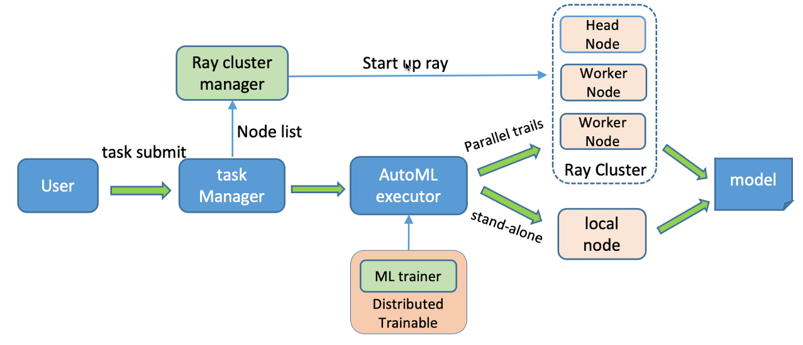

## 简介
dml-autotabular 是建立在FLAML和Ray Tune上的轻量化的自动机器学习工具。目前支持基于表格数据的机器学习任务，包括分类、回归和时序预测任务。
## 功能特性
1. 对分类和回归任务，能在较低计算资源条件下快速找到高质量的模型，可进行模型搜索及超参搜索。
2. 对时序预测任务, 目前支持领先的时序预测模型Autoformer, FEDformer, Transformer and Informer。
3. 支持多核及多节点分布式调优。
### 支持任务类型
- classification: 分类任务
- regression: 回归任务
- forecasting: 时序预测任务

### Architecture

## Parameter description
### 环境参数
    hostfile: type=str, [可选] hostfile 文件路径，计算节点ip列表，用于分布式任务多节点配置。
        注：若使用多节点集群环境训练，则需要提供'node_list' 或'host_file'，否则无法使用多节点训练。

### 输入输出
    train_input: type=str, required=True, 训练数据，该参数必须给出。可为hive表名，hdfs文件路径，或本地/共享文件路径。
    val_input: type=str, [可选]，提供验证数据，格式同训练数据。
    output_dir: type=str, 模型输出路径。
    data_format: type=str, 训练数据文件格式，默认为'table', 支持 ['table', 'parquet', 'orc', 'csv'], "table": hive表。
    feature_cols: type=str, [可选] 特征列表。
    label_cols: type=str, default='label', 标签列表。

### 调参公共参数
    time_budget: type=int, AutoML 自动模型搜索的时间约束（秒），默认值 60。
    seed: type=int, default=0, 随机种子。

### 分类、回归任务专有参数
    metric: type=str, 优化度量
        'roc_auc':  二分类任务默认度量。最小化 1 - roc_auc_score。
        'log_loss': 多分类任务默认度量。
        'r2': 用于回归任务度量，最小化 1 - r2_score 。
    estimator_list: type=str, default='["lgbm"]', 模型列表，支持['lgbm',xgboost']
    fit_kwargs: type=str, [可选]，模型训练参数。以参数字典形式提供，未给出时使用默认参数。
        如：'{"n_jobs":2,"n_concurrent_trials":2,"min_sample_size":10000,"max_iter":100,"eval_method":"holdout","split_ratio":0.1}'，
        其中，
            n_jobs: 每个训练trail分配的cpu数，-1表示不做限制，自动分配。
            n_concurrent_trials: 可并行执行的训练trail数
            min_sample_size: trail 最小采样大小
            max_iter: 调参最大迭代次数
            eval_method: 验证评估方法，如"holdout"，"cv"
            split_ratio: 当 eval_method 为"holdout" 的验证样本拆分比例

### 时序预测任务专有参数

    # tune config
    num_samples: type=int, default=50, 调参训练最大次数（最大训练trail数）
    local_dir: type=str, default='temp/', [可选]，调参训练过程中模型checkpoint保存路径。
                建议使用共享目录，尤其是多节点集群上训练时，如 '/nfs/volume-807-1/tmp/'
    # Distributed config
    resources_per_trial: type=str,
                  help='resources dict like: {"cpu":1, "gpu":1}, number of cpus, gpus for each trial; 0.5 means two training jobs can share one gpu'
    num_workers: type=int,default=1, 调参训练trail的并行进程数。
    num_gpus_per_worker: type=int, default=0, 每个进程分配的gpu数，如果没有gpu，则设为0
    workers_per_host: type=int, default=1, 每个节点分配的进程数。
        例如：有2个节点，每个节点有4 GPUs，如设置num_gpus_per_worker=1，则'workers_per_host'最大可设置为4，此时'num_workers'最大可设置为8

    # data loader
    data_format: type=str, default='textfile', choices=['table', 'array-table', 'textfile', 'tensor'],
        训练数据的格式：
            "table": (2维)hive表 
            "textfile": (2维)表格数据的文本文件路径。
            "array-table": 数组表，数组为3维, DataFrame 格式如:'[("features", "array<array<float>>"), ("target", "array<array<float>>")]'
            "tensor": pytorch tensors 字典格式，如 {"features":X, "target":y} or list like [X, y] with a 3 dimensions '
                    ' X: [# samples x # sequence length x # variables] and target named as "target"')
    split_ratio: type=float, default=0, [可选]，验证数据切分占比，若大于0，则按该比例从训练集中切分作为验证集    
    date_col: type=str, default='date', 日期列
    freq', type=str, default='h', 时间特征编码频率 options:[s:secondly, t:minutely, h:hourly, d:daily, b:business days, w:weekly, m:monthly]
            也可以使用 15min or 3h
    # forecasting task
    seq_len: type=int, default=24, 输入（样本）序列长度
    pred_len: type=int, default=1,  预测序列长度

    # search space
    search_space: type=str, automl 搜索空间，dict 类型，搜索参数包括可选模型类别及模型参数上下限，
        支持参数包括：'model', 'train_epochs', 'learning_rate', 'd_model', 'n_heads', 'd_ff', 'e_layers', 'd_layers', 'batch_size'
        示例：'{"model":["FEDformer","Autoformer"],"d_model":[64,512],"n_heads":[4,8],"d_ff":[128,2048],"learning_rate":[0.00001,0.001]}'
        注：该参数为模型搜索参数设置，优先级高于以对应的'key'单独给出的参数。例如，如果在search_space中给出了"model"空间定义，则单独提供的'model'参数将被屏蔽，其它参数也一样。
    # basic config
    model: type=str, choices=['FEDformer', 'Autoformer', 'Informer', 'Transformer'],
            default='Autoformer', 模型类型。如果该参数已经在'search_space'中定义，则此处定义将被屏蔽。

    # model args define
    d_model: type=int, default=512, help='dimension of model'  如果该参数已经在'search_space'中定义，则此处定义将被屏蔽。
    n_heads: type=int, default=8, help='num of heads' 如果该参数已经在'search_space'中定义，则此处定义将被屏蔽。
    e_layers: type=int, default=2, help='num of encoder layers' 如果该参数已经在'search_space'中定义，则此处定义将被屏蔽。
    d_layers: type=int, default=1, help='num of decoder layers' 如果该参数已经在'search_space'中定义，则此处定义将被屏蔽。
    d_ff: type=int, default=2048, help='dimension of fcn'   如果该参数已经在'search_space'中定义，则此处定义将被屏蔽。
    moving_avg: type=int, default=25, help='window size of moving average'
    dropout: type=float, default=0.05, help='dropout'

    # optimization
    loader_num_workers: type=int, default=10, help='data loader num workers'
    train_epochs: type=int, default=10, help='train epochs'     如果该参数已经在'search_space'中定义，则此处定义将被屏蔽。
    batch_size: type=int, default=32, help='batch size of train input data'    如果该参数已经在'search_space'中定义，则此处定义将被屏蔽。
    learning_rate: type=float, default=0.0001, help='optimizer learning rate'    如果该参数已经在'search_space'中定义，则此处定义将被屏蔽。
    loss: type=str, default='mse', help='loss function'

## Example

    autotabular-classification --train_input alita_dev.criteo_100w --data_format table --output_dir my_model --label_cols "['label']" --feature_cols "['c1','c2','c3','c4','c5','c6','c7','c8','c9','c10','c11','c12','c13','d1','d2','d3','d4','d5','d6','d7','d8','d9','d10','d11','d12','d13','d14','d15','d16','d17','d18','d19','d20','d21','d22','d23','d24','d25','d26']" --time_budget 600 --metric roc_auc --estimator_list '["lgbm","xgboost"]' --seed 1 --fit_kwargs '{"n_jobs":2,"n_concurrent_trials":2,"min_sample_size":100000,"log_type":"all"}'

